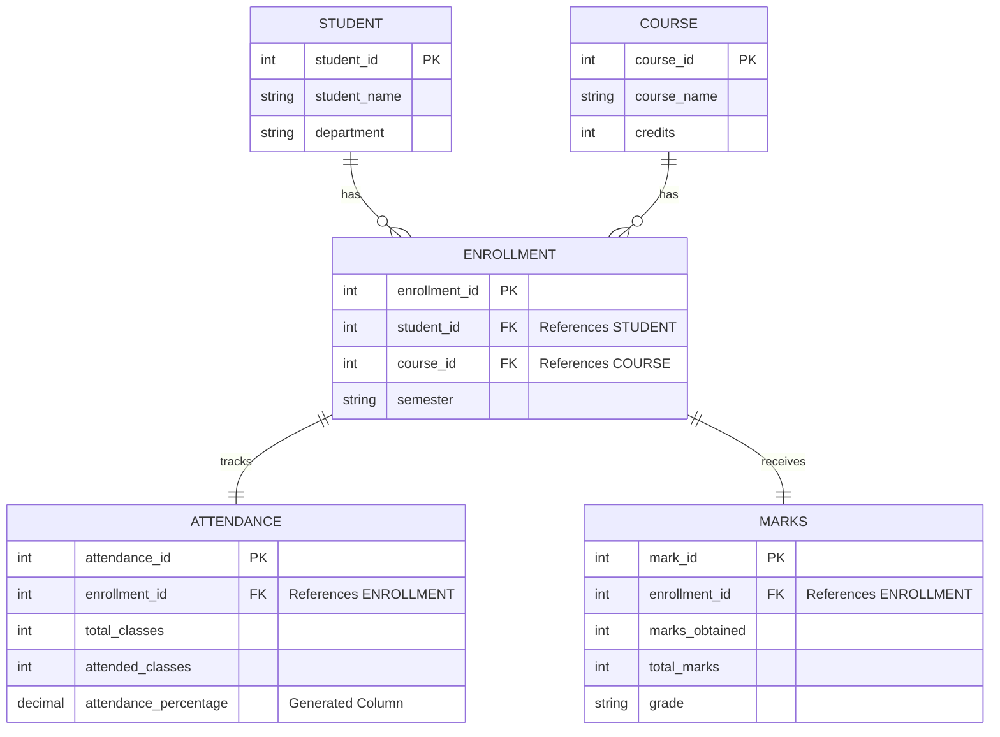

# Student Management System

A comprehensive, full-stack database application designed to manage student-related academic information efficiently. The project applies ER modeling, database normalization, advanced constraints (Triggers & Stored Procedures), and features a modern web interface.

---

## 🎯 Objective
To design and implement a real-world database application to manage student enrollments, track attendance, and record marks. This project demonstrates the practical application of DBMS concepts by connecting a normalized MySQL database to a modern web application frontend.

---

## 🚀 Technologies Used
* **Database**: MySQL (using standard SQL syntax, Constraints, Triggers, and Stored Procedures)
* **Backend API**: Node.js, Express.js, `mysql2` (Connection Pool)
* **Frontend**: Vite, Vanilla JavaScript, HTML5, Vanilla CSS (Glassmorphism aesthetics)

---

## 📊 Entity-Relationship (ER) Model

The database is built upon an Entity-Relationship model consisting of 5 main entities.



### Normalization
The database schema is normalized up to the **Third Normal Form (3NF)**:
1. **1NF**: All attributes contain atomic values.
2. **2NF**: There are no partial dependencies (Primary keys are properly defined).
3. **3NF**: There are no transitive dependencies. The Many-to-Many relationship between `Student` and `Course` was properly resolved using the junction table `Enrollment`. `Attendance` and `Marks` correctly depend on the `Enrollment` rather than duplicating student/course data.

---

## ⚙️ Advanced DBMS Features

1. **Calculated Columns**: The `attendance` table uses a `GENERATED ALWAYS AS` column to automatically calculate the `attendance_percentage` based on total and attended classes.
2. **Triggers (`trg_check_attendance_and_generate_grade`)**: 
   - **Constraint Enforcement**: Fires `BEFORE INSERT` on the `marks` table to ensure the student meets a strict 75% minimum attendance requirement. If they do not, the insertion fails with an error.
   - **Auto Grade Generation**: Dynamically calculates the student's final grade (A+, A, B, C, Fail) based on the marks obtained out of the total marks, automatically populating the `grade` column.
3. **Stored Procedures (`Student_Result` & `RecordMarks`)**: Encapsulates complex `JOIN` logic and secure insert operations so the frontend only needs to pass basic parameters.

---

## 📂 Project Structure

```text
📁 DBMS Project
├── 📜 01_schema.sql                  # DDL: Database and Table creation
├── 📜 02_triggers_procedures.sql     # Advanced Logic: Triggers & Procedures
├── 📜 03_data_queries.sql            # DML/DQL: Data seeding & Complex joins
├── 📁 backend/                       # Node.js API
│   ├── .env                          # MySQL connection variables
│   ├── db.js                         # MySQL connection pool
│   └── server.js                     # Express API routes
└── 📁 frontend/                      # Web UI
    ├── index.html                    # Main HTML Structure
    ├── style.css                     # Premium Glassmorphism CSS
    └── main.js                       # Logic to fetch data from backend API
```

---

## 🛠️ How to Run the Application

### Step 1: Database Setup
Ensure you have a MySQL server running locally. Execute the SQL scripts in the following order using your preferred SQL client (MySQL Workbench, phpMyAdmin, terminal):
1. Execute `01_schema.sql`
2. Execute `02_triggers_procedures.sql`
3. Execute `03_data_queries.sql`

### Step 2: Start the Backend Server
Open a terminal and navigate to the backend folder:
```bash
cd backend
npm install
npm start
```
*Note: Make sure your `backend/.env` file matches your local MySQL credentials.*

### Step 3: Start the Frontend UI
Open a second terminal window and navigate to the frontend folder:
```bash
cd frontend
npm install
npm run dev
```
Open the provided `localhost` link (typically `http://localhost:5173`) in your browser to interact with the database!
